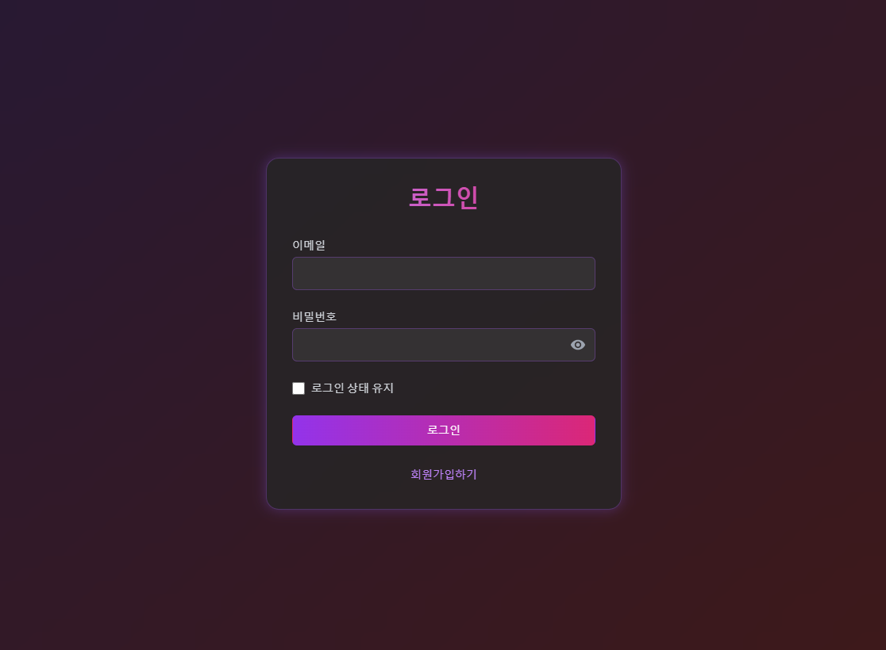

# [🎬 영화 데모 사이트]()

### 프로젝트 설명
TMDB API를 활용한 영화 정보 브라우징 웹 애플리케이션입니다. React와 Tailwind CSS를 사용하여 개발된 이 프로젝트는 영화 검색, 찜하기, 인기 영화 목록 등 다양한 기능을 제공합니다.

배포 링크 :  [클릭 시 링크로 이동](https://2blackcow.github.io/movie/).

---
 
--

---

### 🚀 주요 기능

- 📱 반응형 디자인
- 🔍 영화 검색 및 검색 기록 관리
- ❤️ 영화 찜하기 기능
- 🎯 인기 영화 목록
- 🖱️ 무한 스크롤 및 페이지네이션
- 🔄️ Grid/List 뷰 전환
- ✅ 영화 상세 정보 조회

### 🛠 기술 스택
### Frontend

- **React.js**
- **Redux Toolkit (상태 관리)**
- **React Router v6 (라우팅)**
- **Tailwind CSS (스타일링)**
- **Axios (HTTP 클라이언트)**

### 주요 라이브러리

- **react-icons (아이콘)**
- **react-toastify (알림)**
- **lodash (유틸리티)**

### API

- TMDB API (영화 데이터) 사용
- 회원가입 시 비밀번호로 개인의 TMDB API KEY 입력
- [TMDB API](https://www.themoviedb.org/documentation/api)

### 프로젝트 클론 
```
$ git clone https://github.com/2blackcow/movie.git
$ cd movie
```
### 필수 패키지 설치
```
npm install
```
### 환경 변수 설정
```
.env 파일에 있는 REACT_APP_API_KEY를 
개인의 TMDB API KEY로 설정
```
### 로컬 서버 실행
```
npm start
```
웹사이트는 기본적으로 http://localhost:3000/movie 에서 확인할 수 있습니다.

### 배포 환경에 사용할 파일 생성
```
npm run build
```


## 프로젝트 구조 설명 
```
src/
├── components/                    # 컴포넌트 디렉토리
│   ├── auth/                     # 인증 관련 컴포넌트
│   │   ├── AuthGuard.js         # 인증 상태 검사 컴포넌트
│   │   └── AuthForm.js          # 로그인/회원가입 폼
│   ├── search/                   # 검색 관련 컴포넌트
│   │   └── SearchHistory.js     # 검색 기록 컴포넌트
│   ├── Banner.js                 # 메인 배너 컴포넌트
│   ├── Card.js                   # 영화 카드 컴포넌트
│   ├── ErrorMessage.js           # 에러 메시지 컴포넌트
│   ├── Header.js                 # 헤더 컴포넌트
│   ├── HorizontalScrollCard.js   # 가로 스크롤 카드 컴포넌트
│   ├── LoadingSpinner.js         # 로딩 스피너 컴포넌트
│   ├── MobileNavigation.js       # 모바일 내비게이션
│   ├── Modal.js                  # 모달 컴포넌트
│   ├── MovieSection.js           # 영화 섹션 컴포넌트
│   └── ScrollToTop.js            # 상단 이동 컴포넌트
│
├── constants/                     # 상수 정의
│   ├── api.config.js             # API 설정
│   └── navigation.js             # 네비게이션 설정
│
├── hooks/                        # 커스텀 훅
│   ├── useAuth.js               # 인증 관련 훅
│   └── useFetch.js              # API 요청 훅
│
├── pages/                        # 페이지 컴포넌트
│   ├── Browse.js                # 브라우징 페이지
│   ├── Home.js                  # 홈 페이지
│   ├── MovieDetail.js           # 영화 상세 페이지
│   ├── MyList.js                # 찜한 목록 페이지
│   ├── Popular.js               # 인기 영화 페이지
│   └── SearchPage.js            # 검색 페이지
│
├── routes/                       # 라우팅
│   └── index.js                 # 라우트 설정
│
├── store/                        # Redux 스토어
│   ├── movieSlice.js            # 영화 관련 리듀서
│   └── store.js                 # 스토어 설정
│
├── utils/                        # 유틸리티
│   └── localStorage.js          # 로컬 스토리지 관리
│
├── App.js                        # 앱 컴포넌트
└── index.js                      # 진입점
```